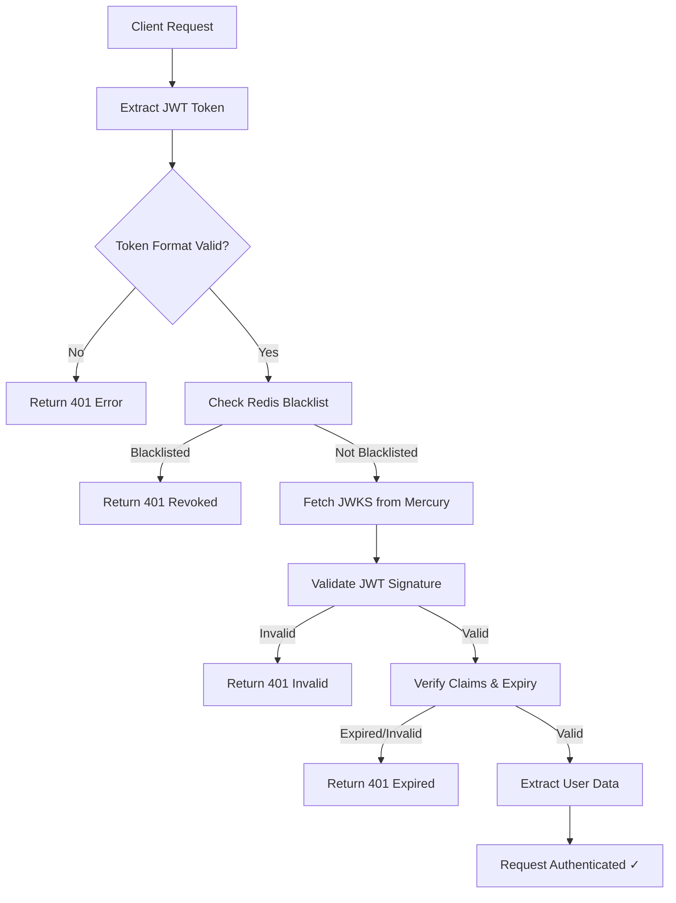
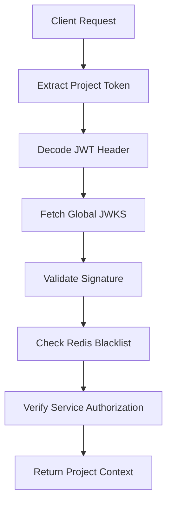

# Laravel Auth Guard

<div align="center">


**Production-ready JWT and Project authentication package for Laravel applications**

*Secure, scalable, and feature-complete authentication solution with JWKS support, Redis caching, and GraphQL integration.*

[Quick Start](#quick-start) • [Installation](#installation) • [Configuration](#configuration) • [Usage Examples](#usage-examples) • [GraphQL Integration](#graphql-integration) • [Troubleshooting](#troubleshooting)

</div>

---

## ✨ Key Features

- 🔐 **JWT Authentication** - RS512 algorithm with automatic key rotation via JWKS
- 🏢 **Project Token Authentication** - Mercury service integration for project-level access control
- 🚀 **Combined Authentication** - Support for dual JWT + Project token validation
- ⚡ **Redis-Powered** - High-performance caching and token blacklisting
- 📊 **GraphQL Ready** - Native Lighthouse GraphQL directives (`@jwtAuth`, `@projectAuth`)  
- 🔄 **Token Revocation** - Real-time token blacklisting and invalidation
- 🐳 **Docker Compatible** - Production-ready containerization support
- 🛠️ **Auto-Discovery** - Zero-config Laravel package registration
- 📝 **Comprehensive Logging** - Optional detailed authentication flow logging
- 🧪 **Fully Tested** - Battle-tested in production environments

---

## 🚀 Quick Start

Get up and running in 5 minutes:

```bash
# 1. Install the package
composer require wazobiatech/laravel-auth-guard

# 2. Install Redis (if not already installed)
composer require predis/predis

# 3. Publish configuration
php artisan vendor:publish --tag=auth-guard-config

# 4. Configure environment variables
cp vendor/wazobiatech/laravel-auth-guard/.env.sample .env.example
# Add the variables to your .env file

# 5. Set up Redis connection in config/database.php
# (See detailed instructions below)

# 6. Start using authentication in your routes/GraphQL
```

**That's it!** You can now use `@jwtAuth` and `@projectAuth` directives in GraphQL or `jwt.auth` and `project.auth` middleware in routes.

---

## 📋 Table of Contents

- [Requirements](#requirements)
- [Installation](#installation)
- [Configuration](#configuration)
  - [Environment Setup](#environment-setup)
  - [Redis Configuration](#redis-configuration)
  - [Mercury Integration](#mercury-integration)
- [Usage Examples](#usage-examples)
  - [GraphQL Authentication](#graphql-authentication)
  - [REST API Authentication](#rest-api-authentication)
  - [Programmatic Usage](#programmatic-usage)
- [GraphQL Integration](#graphql-integration)
- [Authentication Flow](#authentication-flow)
- [Token Management](#token-management)
- [Testing & Debugging](#testing--debugging)
- [Troubleshooting](#troubleshooting)
- [Production Deployment](#production-deployment)
- [API Reference](#api-reference)

---

## ⚙️ Requirements

| Component | Version | Required |
|-----------|---------|----------|
| **PHP** | `^8.0` | ✅ Required |
| **Laravel** | `^9.0 \| ^10.0 \| ^11.0 \| ^12.0` | ✅ Required |
| **Redis** | `Latest` | ✅ Required |
| **Redis Client** | Predis `^2.0` or PhpRedis | ✅ Required |
| **Mercury Service** | Mercury API access | ✅ Required for project auth |
| **Lighthouse GraphQL** | `^6.0 \| ^7.0` | ⚠️ Optional (for GraphQL) |

### System Requirements
- **Memory**: Minimum 128MB (256MB recommended)
- **Network**: HTTPS access to Mercury service endpoints
- **Redis**: Dedicated database for authentication (recommended DB 2)

---

## 📦 Installation

### Step 1: Install the Package

```bash
composer require wazobiatech/laravel-auth-guard
```

*The service provider will be automatically registered via Laravel's package discovery.*

### Step 2: Install Redis Client

Choose one of these Redis clients:

**Option A: Predis (Recommended - Pure PHP)**
```bash
composer require predis/predis
```

**Option B: PhpRedis Extension (Higher Performance)**
```bash
# Ubuntu/Debian
sudo apt-get install php-redis

# Alpine Linux (Docker)
apk add php82-pecl-redis

# macOS (Homebrew)
brew install php@8.2
pecl install redis

# Windows (XAMPP)
# Download php_redis.dll and add to php.ini
```

### Step 3: Publish Configuration

```bash
php artisan vendor:publish --tag=auth-guard-config
```

This creates `config/auth-guard.php` with all configuration options.

### Step 4: Verify Installation

```bash
# Test Redis connection
php artisan tinker
>>> Redis::ping()
# Should return: "+PONG"

# Check package registration
>>> app('Wazobia\LaravelAuthGuard\Services\JwtAuthService')
# Should return service instance
```

---

## 🔧 Configuration

### Environment Setup

The package provides a comprehensive `.env.sample` with all configuration options:

```bash
# Copy sample environment file
cp vendor/wazobiatech/laravel-auth-guard/.env.sample .env.auth-guard

# Add to your main .env file
cat .env.auth-guard >> .env
```

### Core Environment Variables

```bash
# ============================================
# MERCURY SERVICE (Required)
# ============================================
MERCURY_BASE_URL=https://mercury.tiadara.com
SIGNATURE_SHARED_SECRET=your-hmac-shared-secret
SERVICE_ID=your-unique-service-identifier

# ============================================  
# JWT CONFIGURATION
# ============================================
JWT_ALGORITHM=RS512                    # Algorithm for JWT validation
JWT_LEEWAY=30                         # Clock skew tolerance (seconds)

# ============================================
# CACHING & PERFORMANCE  
# ============================================
AUTH_CACHE_TTL=3600                   # Token cache duration (seconds)
AUTH_CACHE_PREFIX=auth_guard          # Redis key prefix
MERCURY_TIMEOUT=10                    # HTTP request timeout (seconds)

# ============================================
# REDIS CONFIGURATION
# ============================================
REDIS_AUTH_DB=2                       # Dedicated Redis DB for auth
REDIS_HOST=127.0.0.1                  # Redis server host
REDIS_PORT=6379                       # Redis server port
REDIS_PASSWORD=                       # Redis password (if required)

# ============================================
# HEADERS & SECURITY
# ============================================  
AUTH_JWT_HEADER=Authorization         # JWT token header name
AUTH_PROJECT_TOKEN_HEADER=X-Project-Token  # Project token header

# ============================================
# LOGGING & DEBUGGING
# ============================================
AUTH_LOGGING_ENABLED=false           # Enable detailed auth logging
AUTH_LOG_CHANNEL=stack               # Laravel log channel to use
```

### Advanced Configuration Options

**Production Optimizations:**
```bash
# Performance tuning
AUTH_CACHE_TTL=7200                   # Longer cache for production
MERCURY_TIMEOUT=5                     # Faster timeout for prod
JWT_LEEWAY=10                        # Reduced clock skew tolerance

# Security hardening  
AUTH_LOGGING_ENABLED=false           # Disable verbose logging
```

**Development Setup:**
```bash
# Development settings
AUTH_CACHE_TTL=60                    # Short cache for testing  
AUTH_LOGGING_ENABLED=true            # Enable debug logging
JWT_LEEWAY=60                        # Generous clock skew for dev
```

**Docker Environment:**
```bash
# Docker-specific settings
REDIS_HOST=redis                     # Docker Compose service name
REDIS_PORT=6379                      
MERCURY_BASE_URL=https://mercury.tiadara.com  # External service
```

### Redis Setup

Update `config/database.php`:

```php
<?php

return [
    // ... other config

    'redis' => [
        'client' => env('REDIS_CLIENT', 'predis'),

        'options' => [
            'cluster' => env('REDIS_CLUSTER', 'redis'),
            'prefix' => env('REDIS_PREFIX', Str::slug(env('APP_NAME', 'laravel'), '_').'_database_'),
        ],

        'default' => [
            'url' => env('REDIS_URL'),
            'host' => env('REDIS_HOST', '127.0.0.1'),
            'username' => env('REDIS_USERNAME'),
            'password' => env('REDIS_PASSWORD'),
            'port' => env('REDIS_PORT', '6379'),
            'database' => env('REDIS_DB', '0'),
        ],

        'cache' => [
            'url' => env('REDIS_URL'),
            'host' => env('REDIS_HOST', '127.0.0.1'),
            'username' => env('REDIS_USERNAME'),
            'password' => env('REDIS_PASSWORD'),
            'port' => env('REDIS_PORT', '6379'),
            'database' => env('REDIS_CACHE_DB', '1'),
        ],
        
        // Authentication connection for token blacklisting
        'auth' => [
            'url' => env('REDIS_URL'),
            'host' => env('REDIS_HOST', '127.0.0.1'),
            'username' => env('REDIS_USERNAME'),
            'password' => env('REDIS_PASSWORD'),
            'port' => env('REDIS_PORT', '6379'),
            'database' => env('REDIS_AUTH_DB', '2'), // Separate DB for auth tokens
            'prefix' => '', // No prefix for auth tokens
        ],
    ],
];
```

### Verify Redis Connection

```bash
php artisan tinker
```

Test inside Tinker:
```php
Redis::ping();  // Should return: "+PONG"

Redis::set('test', 'Hello');
Redis::get('test');  // Should return: "Hello"

// Test auth connection
Redis::connection('auth')->ping();  // Should return: "+PONG"

exit
```

---

## 🔐 Authentication Flow

### JWT Authentication Process



**Step-by-step Process:**

1. **Token Extraction** - JWT extracted from `Authorization: Bearer <token>` header
2. **Format Validation** - Verify token has 3 parts (header.payload.signature)
3. **Blacklist Check** - Check Redis for revoked tokens (JTI-based)
4. **JWKS Retrieval** - Fetch public keys from Mercury JWKS endpoint
5. **Signature Verification** - Validate token signature using RS512 algorithm
6. **Claims Validation** - Check expiry (`exp`), issuer (`iss`), and custom claims
7. **User Context** - Extract user information and inject into request

### Project Token Authentication Process



**Project Token Flow:**
1. **Token Extraction** - Extract from `X-Project-Token` header  
2. **Global JWKS** - Use Mercury's global project JWKS (not per-project)
3. **Signature Validation** - Verify using RS512 and global project keys
4. **Blacklist Check** - Check Redis for revoked project tokens
5. **Service Authorization** - Verify current service is in `enabled_services`
6. **Project Context** - Inject project data into request

### Token Blacklisting System

**Redis-Based Blacklist:**
- **Key Pattern**: `project_token:{token_id}` or `jwt:{jti}`
- **Logic**: Token exists in Redis = Blacklisted ❌ | Token absent = Valid ✅
- **Auto-Expiry**: Blacklist entries expire when original token expires
- **Performance**: O(1) lookup time with Redis
- **Scalability**: Works across multiple application instances

```php
// Example: Blacklist a token
$redis = Redis::connection('auth');
$redis->setex("project_token:{$tokenId}", $ttl, 1);

// Check if blacklisted
$isBlacklisted = $redis->exists("project_token:{$tokenId}");
```

### Service Provider

If not using auto-discovery, add to `config/app.php`:

```php
'providers' => [
    // ...
    Wazobia\LaravelAuthGuard\AuthGuardServiceProvider::class,
],
```

---

## 🎨 GraphQL Setup (Lighthouse)

### Step 1: Install Lighthouse

```bash
composer require nuwave/lighthouse
```

### Step 2: Configure Directives

Edit `config/lighthouse.php` and add the directive namespace:

```php
<?php

return [
    'namespaces' => [
        'models' => ['App', 'App\\Models'],
        'queries' => 'App\\GraphQL\\Queries',
        'mutations' => 'App\\GraphQL\\Mutations',
        'subscriptions' => 'App\\GraphQL\\Subscriptions',
        'interfaces' => 'App\\GraphQL\\Interfaces',
        'unions' => 'App\\GraphQL\\Unions',
        'scalars' => 'App\\GraphQL\\Scalars',
        
        'directives' => [
            'App\\GraphQL\\Directives',
            'Wazobia\\LaravelAuthGuard\\GraphQL\\Directives', // ← Add this line
        ],
    ],
];
```

### Step 3: Clear All Caches

```bash
php artisan cache:clear
php artisan config:clear
php artisan route:clear
php artisan lighthouse:clear-cache
composer dump-autoload
```

### Step 4: Validate Schema

```bash
php artisan lighthouse:validate-schema
```

---

## 📚 Usage Examples

### GraphQL Authentication

**Simple JWT Authentication:**
```graphql
type Query {
  # Requires valid JWT token in Authorization header
  me: User! @jwtAuth
  
  # Requires valid project token in X-Project-Token header  
  projectInfo: Project! @projectAuth
  
  # Requires both JWT and project tokens
  secureData: SecureData! @combinedAuth
}

type User {
  uuid: ID!
  email: String!
  name: String!
}

type Project {
  project_uuid: ID!
  enabled_services: [String!]!
}
```

**GraphQL Resolver Example:**
```php
<?php
namespace App\GraphQL\Queries;

class Me
{
    public function __invoke($root, array $args, $context)
    {
        // User automatically available via @jwtAuth directive
        $user = $context->request->user();
        
        return [
            'uuid' => $user->uuid,
            'email' => $user->email,
            'name' => $user->name,
        ];
    }
}
```

### REST API Authentication

**Basic Route Protection:**
```php
<?php
use Illuminate\Support\Facades\Route;
use Illuminate\Http\Request;

// JWT Authentication
Route::middleware('jwt.auth')->group(function () {
    Route::get('/user/profile', function (Request $request) {
        $user = $request->user(); // Automatically injected
        return response()->json([
            'uuid' => $user->uuid,
            'email' => $user->email,
            'name' => $user->name,
        ]);
    });
});

// Project Authentication  
Route::middleware('project.auth')->group(function () {
    Route::get('/project/info', function (Request $request) {
        $project = $request->project; // Automatically injected
        return response()->json([
            'project_uuid' => $project->project_uuid,
            'enabled_services' => $project->enabled_services,
        ]);
    });
});

// Combined Authentication (both required)
Route::middleware('combined.auth')->group(function () {
    Route::post('/secure/action', function (Request $request) {
        $user = $request->user();
        $project = $request->project;
        
        return response()->json([
            'message' => 'Authenticated successfully',
            'user_id' => $user->uuid,
            'project_id' => $project->project_uuid,
        ]);
    });
});
```

### Programmatic Usage

**Direct Service Usage:**
```php
<?php
use Wazobia\LaravelAuthGuard\Services\JwtAuthService;
use Wazobia\LaravelAuthGuard\Services\ProjectAuthService;

class AuthController
{
    public function validateJwt(JwtAuthService $jwtService, Request $request)
    {
        try {
            $token = $request->bearerToken();
            $user = $jwtService->authenticate($token);
            
            return response()->json([
                'valid' => true,
                'user' => $user
            ]);
        } catch (\Exception $e) {
            return response()->json([
                'valid' => false,
                'error' => $e->getMessage()
            ], 401);
        }
    }
    
    public function validateProject(ProjectAuthService $projectService, Request $request)
    {
        try {
            $token = $request->header('X-Project-Token');
            $serviceId = config('auth-guard.service_id');
            
            $project = $projectService->authenticateWithToken($token, $serviceId);
            
            return response()->json([
                'valid' => true,
                'project' => $project
            ]);
        } catch (\Exception $e) {
            return response()->json([
                'valid' => false,
                'error' => $e->getMessage()
            ], 401);
        }
    }
}

### GraphQL Schema

Create or update `graphql/schema.graphql`:

```graphql
type Query {
  # Public query
  hello: String!
  
  # JWT authentication required
  me: User! @jwtAuth
  
  # Project authentication required
  projectInfo: Project! @projectAuth
  
  # Both authentications required
  secureData: SecureData! @combinedAuth
}

type Mutation {
  updateProfile(name: String!): User! @jwtAuth
  updateProjectSettings(settings: JSON!): Project! @projectAuth
  createResource(data: JSON!): Resource! @combinedAuth
}

type User {
  uuid: ID!
  email: String!
  name: String!
}

type Project {
  project_uuid: ID!
  enabled_services: [String!]!
  secret_version: Int
}

type SecureData {
  id: ID!
  content: String!
  user: User!
  project: Project!
}
```

### GraphQL Resolvers

**app/GraphQL/Queries/Me.php**

```php
<?php

namespace App\GraphQL\Queries;

class Me
{
    public function __invoke($rootValue, array $args, $context)
    {
        $user = $context->request->user();
        return [
            'uuid' => $user->uuid,
            'email' => $user->email,
            'name' => $user->name,
        ];
    }
}
```

**app/GraphQL/Queries/ProjectInfo.php**

```php
<?php

namespace App\GraphQL\Queries;

class ProjectInfo
{
    public function __invoke($rootValue, array $args, $context)
    {
        $project = $context->request->project;
        
        return [
            'project_uuid' => $project->project_uuid,
            'enabled_services' => $project->enabled_services,
            'secret_version' => $project->secret_version,
        ];
    }
}
```

---

## 🧪 Testing

### REST API with cURL

**JWT Authentication**
```bash
curl -X GET http://localhost:8000/api/user/profile \
  -H "Authorization: Bearer YOUR_JWT_TOKEN" \
  -H "Accept: application/json"
```

**Project Authentication**
```bash
curl -X GET http://localhost:8000/api/project/info \
  -H "x-project-token: YOUR_PROJECT_TOKEN" \
  -H "Accept: application/json"
```

**Combined Authentication**
```bash
curl -X POST http://localhost:8000/api/secure/resource \
  -H "Authorization: Bearer YOUR_JWT_TOKEN" \
  -H "x-project-token: YOUR_PROJECT_TOKEN" \
  -H "Content-Type: application/json" \
  -d '{"data": "test"}'
```

### GraphQL Queries

**Query with JWT Auth**
```bash
curl -X POST http://localhost:8000/graphql \
  -H "Content-Type: application/json" \
  -H "Authorization: Bearer YOUR_JWT_TOKEN" \
  -d '{"query":"{ me { uuid email name } }"}'
```

**Expected Response:**
```json
{
  "data": {
    "me": {
      "uuid": "user-uuid-here",
      "email": "user@example.com",
      "name": "John Doe"
    }
  }
}
```

### GraphQL Playground

1. Access GraphQL Playground at `http://localhost:8000/graphql-playground`
2. Add headers in the bottom left:

```json
{
  "Authorization": "Bearer YOUR_JWT_TOKEN",
  "x-project-token": "Bearer YOUR_PROJECT_TOKEN"
}
```

3. Run queries:

```graphql
query {
  me {
    uuid
    email
    name
  }
  
  projectInfo {
    project_uuid
    enabled_services
  }
}
```

---

## 🔍 Troubleshooting

<details>
<summary><strong>❌ "No directive found for jwtAuth"</strong></summary>

**Solution:**
1. Add directive namespace to `config/lighthouse.php`
2. Clear all caches:
```bash
php artisan config:clear
php artisan lighthouse:clear-cache
composer dump-autoload
```
</details>

<details>
<summary><strong>❌ "Class Predis\Client not found"</strong></summary>

**Solution:**
```bash
composer require predis/predis
php artisan config:clear
```

Or change `.env`:
```properties
REDIS_CLIENT=phpredis
```
</details>

<details>
<summary><strong>❌ "Could not connect to Redis"</strong></summary>

**Solution:**

1. Verify Redis is running:
```bash
redis-cli ping  # Should return: PONG
```

2. Check your `.env`:
```properties
# For Docker
REDIS_HOST=redis

# For local
REDIS_HOST=127.0.0.1
```

3. Test connection:
```bash
php artisan tinker
Redis::ping();
```
</details>

<details>
<summary><strong>❌ "JWKS endpoint returned 401"</strong></summary>

**Solution:**

Check that `SIGNATURE_SHARED_SECRET` in `.env` matches your Mercury service configuration.
</details>

<details>
<summary><strong>❌ "Token has been revoked or expired"</strong></summary>

**Solution:**

The project token is either:
- Not found in Redis (expired)
- Manually revoked

Generate a new project token from your provisioning service.
</details>

### Docker-Specific Issues

**Redis Connection Refused**

Update `docker-compose.yml`:
```yaml
services:
  app:
    depends_on:
      - redis
    environment:
      - REDIS_HOST=redis
      
  redis:
    image: redis:alpine
    ports:
      - "6379:6379"
```

**PhpRedis Not Installed**

Add to your `Dockerfile`:
```dockerfile
RUN pecl install redis && docker-php-ext-enable redis
```

Then rebuild:
```bash
docker-compose build --no-cache
docker-compose up -d
```

---

## 🔥 Advanced Usage

### Programmatic Token Validation

```php
use Wazobia\LaravelAuthGuard\Services\JwtAuthService;
use Wazobia\LaravelAuthGuard\Services\ProjectAuthService;

class AuthController
{
    public function validateJwt(JwtAuthService $jwtService, Request $request)
    {
        try {
            $token = $request->bearerToken();
            $user = $jwtService->authenticate($token);
            
            return response()->json(['user' => $user]);
        } catch (\Exception $e) {
            return response()->json(['error' => $e->getMessage()], 401);
        }
    }
    
    public function validateProject(ProjectAuthService $projectService, Request $request)
    {
        try {
            $token = $request->header('x-project-token');
            $serviceId = config('auth-guard.service_id');
            
            $project = $projectService->authenticateWithToken($token, $serviceId);
            
            return response()->json(['project' => $project]);
        } catch (\Exception $e) {
            return response()->json(['error' => $e->getMessage()], 401);
        }
    }
}
```

### Token Revocation & Blacklisting

The package uses Redis as a **blacklist system** for token revocation:

```php
use Wazobia\LaravelAuthGuard\Services\JwtAuthService;

Route::post('/logout', function (JwtAuthService $jwtService, Request $request) {
    $jti = $request->input('jti'); // JWT ID from token payload
    $ttl = 3600; // Blacklist for 1 hour (or until token expires)
    
    // Add token to Redis blacklist
    $jwtService->revokeToken($jti, $ttl);
    
    return response()->json(['message' => 'Token revoked and blacklisted']);
})->middleware('jwt.auth');
```

**How Blacklisting Works:**

1. **Before Revocation**: Token JTI not in Redis → Token is valid ✅
2. **After Revocation**: Token JTI stored in Redis → Token is blacklisted ❌
3. **Auto-Expiry**: Blacklist entry expires when TTL reached or token expires
4. **Validation**: All future requests check Redis first before validating signature

**Manual Blacklist Management:**

```php
use Illuminate\Support\Facades\Redis;

// Check if token is blacklisted
$isBlacklisted = Redis::connection('auth')->exists("jti:{$tokenJti}");

// Manually blacklist a token
Redis::connection('auth')->setex("jti:{$tokenJti}", $ttl, 1);

// Remove from blacklist (un-revoke)
Redis::connection('auth')->del("jti:{$tokenJti}");
```

---

## 🛠 Troubleshooting

### Common Issues

**1. "Redis connection [auth] not configured" Error**

Make sure you have added the `auth` Redis connection to `config/database.php`:

```php
'redis' => [
    // ... other connections
    'auth' => [
        'url' => env('REDIS_URL'),
        'host' => env('REDIS_HOST', '127.0.0.1'),
        'username' => env('REDIS_USERNAME'),
        'password' => env('REDIS_PASSWORD'),
        'port' => env('REDIS_PORT', '6379'),
        'database' => env('REDIS_AUTH_DB', '2'),
        'prefix' => '',
    ],
],
```

**2. "Project unauthenticated" Error**

Enable logging to debug authentication flow:

```env
AUTH_LOGGING_ENABLED=true
AUTH_LOG_CHANNEL=single
```

Check your logs for detailed authentication steps.

**3. Token Always Rejected**

Verify Redis blacklist behavior:

```bash
php artisan tinker
```

```php
// Check if your token JTI is in Redis blacklist
$jti = 'your-token-jti-here';
$exists = Redis::connection('auth')->exists("jti:{$jti}");
echo $exists ? 'Token is blacklisted' : 'Token is valid';
```

**4. Mercury Service Connection Issues**

Test Mercury connectivity:

```php
$response = Http::get(config('auth-guard.mercury.base_url') . '/health');
echo $response->successful() ? 'Mercury is reachable' : 'Mercury connection failed';
```

**5. Clear All Caches After Configuration Changes**

```bash
php artisan cache:clear
php artisan config:clear
php artisan route:clear
composer dump-autoload
```

---

## 📚 Documentation

| Topic | Description |
|-------|-------------|
| **Middleware** | `jwt.auth`, `project.auth`, `combined.auth` |
| **Directives** | `@jwtAuth`, `@projectAuth`, `@combinedAuth` |
| **Services** | `JwtAuthService`, `ProjectAuthService` |
| **Caching** | Redis-based JWKS and token caching |

---

## 🤝 Support

For issues or questions:

- **GitHub Issues:** [Report an issue](https://github.com/wazobia/laravel-auth-guard/issues)
- **Email:** developer@wazobia.tech
- **Documentation:** [Full Documentation](https://docs.wazobia.tech)

---

## 📄 License

This package is open-sourced software licensed under the [MIT license](LICENSE.md).

---

<div align="center">

**Made with ❤️ by [Wazobia Technologies](https://wazobia.tech)**

⭐ Star us on GitHub if this helped you!

</div>